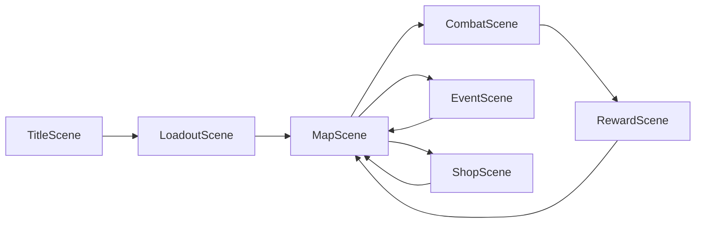

# Asset pipeline, animation, and level progression (review)

Portable notes derived from the **first-fight** codebase (Three.js + Electron + Vite). When you move this to another project, adapt file paths and stack details; the **concepts** (GLB manifest, semantics, map flow, sourcing) still apply.

---

## Stack snapshot

- **Runtime:** Electron + Vite + TypeScript + Three.js (`GLTFLoader`, `SkeletonUtils.clone` for instances).
- **Assets:** GLBs referenced as static imports with `?url`; central catalog in `src/renderer/src/assets/AssetLibrary.ts`.
- **Placement rules:** Semantic registry in `src/renderer/src/levels/AssetSemantics.ts` (floor, wall, hazard, traversal, etc.).

---

## What exists today

### Environment

One cohesive kit under `src/renderer/src/assets/environment/mini-dungeon/` (banner, barrel, chest, columns, walls, floor variants, trap, weapons, wood pieces, etc.—on the order of **20** entries in `MINI_DUNGEON_ASSET_IDS`).

### Characters

Twelve `mini-characters` GLBs (female/male A–F) registered alongside environment assets in `AssetLibrary.ts`.

### GLBs in version control

If `.glb` files are not in the repo (local-only, LFS, or another machine), align on **git-LFS**, a **documented asset drop-in**, or a **submodule** before scaling art so builds and collaborators stay reproducible.

### Combat arenas

`src/renderer/src/Game.ts` builds levels with `createStarterLevelDefinition()` + `composeLevel()`.

`src/renderer/src/levels/LevelDefinition.ts` supports a `levelIndex` for seeding, but **`Game` historically called `createStarterLevelDefinition()` with the default** (`levelIndex = 1`). Procedural dressing can still vary if the seed mixes time (`Date.now()`), while **hand-placed center pieces** (column, banner, stairs, etc.) may repeat unless you drive layout from node/run seed or presets.

### Progression flow (meta-game)

Progression is **roguelike map columns**, not numbered “dungeon floors” inside one scene:

- `src/renderer/src/map/MapGraph.ts` — graph of nodes by column.
- `src/renderer/src/scenes/MapScene.ts` — pick a node in the current column → branch to `CombatScene`, `EventScene`, or `ShopScene`.
- Combat **victory** → `RewardScene` → back to map (`src/renderer/src/scenes/RewardScene.ts`).
- **Loss** — `gameOver` path in UI (`src/renderer/src/ui/GameUI.ts`); no reward continuation.

### Animations

There is **no** `AnimationMixer` / GLTF clip playback in the original review. Motion is **code-driven**: unit root **lerp** for moves, **emissive** flashes for hits, map/node pulses, loadout preview spin, etc. See `src/renderer/src/entities/UnitEntity.ts`, `src/renderer/src/combat/CombatActions.ts`, `src/renderer/src/combat/TurnManager.ts` (combat phase includes `'animating'` for gameplay pacing, not skeletal states).

---

## Growing assets (short term: mostly free)

**Style:** Low-poly / “mini kit” reads best if new packs match **scale**, **palette**, and **lighting**—or you commit to one post-process look for the whole game.

**Free sources (verify license per file):**

- **Kenney** — CC0, large kits; export to GLB.
- **Quaternius** — CC0 low-poly dungeon/characters.
- **KayKit / Kay Lousberg** — free samples + optional paid full sets.
- **Poly Pizza / Sketchfab** — filter CC0 / CC-BY; keep an `ATTRIBUTION.md` if required.
- **OpenGameArt** — mixed quality; check license and formats.

**Paid (when budget fits):** Packs with **FBX/GLB + textures**, explicit game license, **modular** walls/floors if you stay grid-based (`LevelComposer`-style placement).

### Pipeline to add a new prop (typical for this architecture)

1. Add `something.glb` under `environment/...` (or a new theme subfolder).
2. Register URL import + catalog entry in `AssetLibrary.ts`.
3. Register semantics in `AssetSemantics.ts` (`kind`, `blocksTraversal`, tags).
4. Reference in `LevelDefinition.ts` as static props and/or `procedural.propRules` / prefabs.

### Multiple themes without spaghetti

Add a **second catalog** (e.g. forest IDs) parallel to the dungeon list; select by **faction**, **combat type** (regular / elite / boss), or **map node**. `Game` already receives combat context in its constructor—good hook for swapping definitions.

---

## Animation options

| Approach | Effort | Notes |
|----------|--------|--------|
| **A — Juice** | Low | Hit stop, camera nudge, particles, trails, stronger hit flashes; fits current lerp-based units. |
| **B — Skeletal GLTF** | High | `AnimationMixer` per unit; named clips (`idle`, `run`, `attack`, `hit`); needs assets with **real clips**, not T-pose-only meshes. |
| **C — Hybrid** | Medium | 2D billboards / VFX on static 3D bodies. |

---

## Where variety actually matters

| Layer | Typical state | Improvement |
|-------|----------------|-------------|
| **Meta map** | Columns, node types, factions | Optional **visual map themes** per act (separate from combat GLBs). |
| **Combat arena** | Same template + procedural seed | Pass a **stable seed** from map node id + run id into level creation; **elite/boss** larger grids or different prefab sets in `LevelDefinition`. |

---

## Suggested implementation order

1. Reliable **GLB delivery** in repo or documented process.
2. **Deterministic arena seeds** from map/run (and optional `combatType` presets).
3. **Second environment theme** to validate the multi-catalog pipeline before buying large packs.
4. **Animation tier decision:** juice-only vs `AnimationMixer` vs hybrid, aligned with art budget.

---

## Follow-up checklist (optional)

- [ ] Confirm `.glb` workflow for team/CI (LFS, folder, submodule).
- [ ] Wire `levelIndex` or node seed from combat entry into `createStarterLevelDefinition` (or equivalent).
- [ ] Add parallel asset catalog + semantics for a second biome.
- [ ] Choose animation strategy and clip naming if using mixers.

---

*End of portable notes.*
